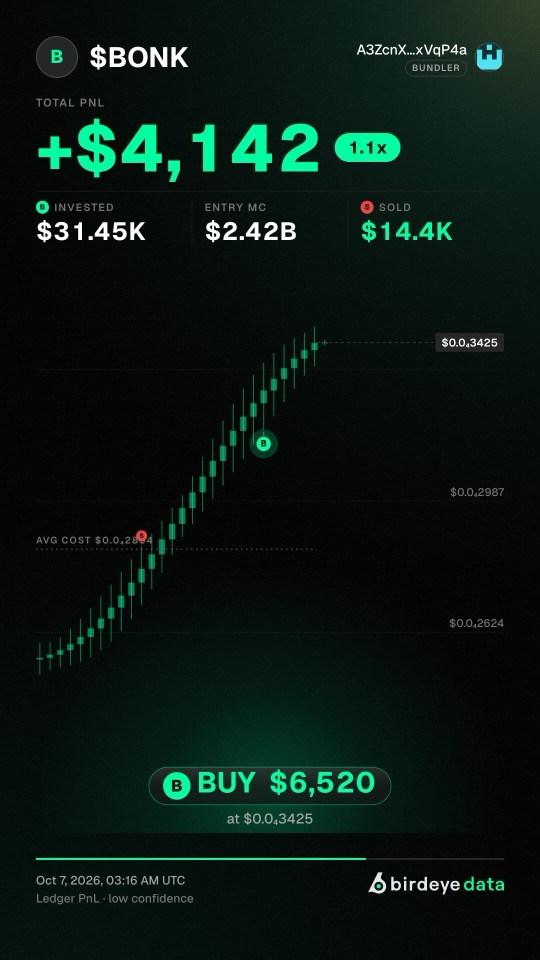
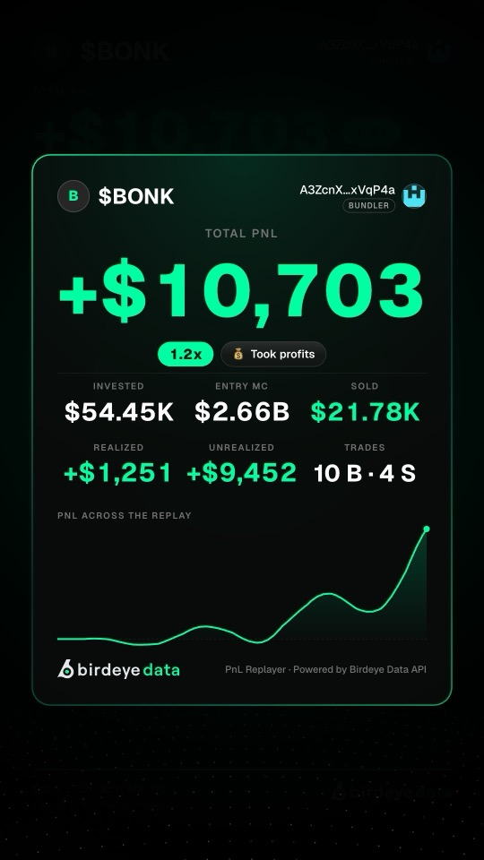
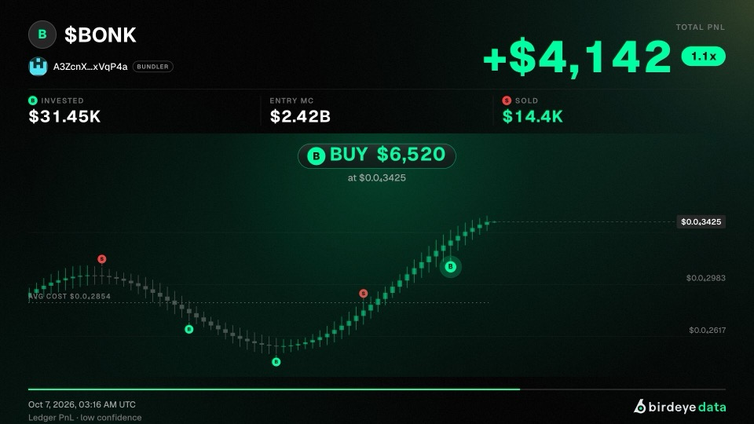

# PnL Replayer

**Replay any Solana wallet's trades on a token, audit its PnL, and export the
replay as a shareable video.** It is built entirely on the
[Birdeye Data API](https://data.birdeye.so). Candles, trader rankings, wallet
balance changes and USD-priced swaps all come from one provider, and videos
render in the browser with no server.

[](https://github.com/deanle-wq/pnl-replayer/actions/workflows/ci.yml)
[](./LICENSE)


[](https://vercel.com/new/clone?repository-url=https%3A%2F%2Fgithub.com%2Fdeanle-wq%2Fpnl-replayer&project-name=pnl-replayer&repository-name=pnl-replayer)

| Replay (9:16) | Result card | Replay (16:9) |
|---|---|---|
|  |  |  |

<sub>Frames from the built-in sample dataset (synthetic wallets).</sub>

## What it does

1. **Trader board.** Paste a token mint. Six Birdeye Top Traders rankings are
   unioned (winners, losers, volume, holders) and scored with Birdeye Wallet
   PnL (weighted average cost), with each wallet's Invested and multiple.
2. **Ledger audit.** Any wallet can be rebuilt from its own balance changes,
   joined to decoded swaps by transaction signature. Each audit gets a
   high, medium or low confidence grade and a delta against Birdeye's number.
3. **PnL video.** Each row opens a clip editor. It replays the wallet's own
   trading window candle by candle: buys and sells pop up, PnL and its
   multiple run live next to Invested, Entry MC and Sold, and it ends on a
   game-style result card with the wallet's tags. Export MP4 or WebM in 16:9,
   9:16 or 1:1 at 1080p, with sound, rendered in the browser.

## Quick start

Requires Node.js 20.9 or newer and a Birdeye Data API key.

```bash
git clone https://github.com/deanle-wq/pnl-replayer.git
cd pnl-replayer
cp .env.example .env.local   # then set BIRDEYE_API_KEY
npm install
npm run dev
```

Open http://localhost:3000 and enter a Solana mint. No key yet? Click
**Try the sample dataset** to explore the full UI with clearly labelled
synthetic data.

## Bring your own key

Visitors can paste their own Birdeye Data API key in the app, so a public
deployment does not have to spend its own compute units.

- The key is kept in the tab's memory only: no localStorage, cookies or URLs.
- It travels to this app's API routes in an `x-birdeye-api-key` header, and
  from there to Birdeye. It is never logged.
- A visitor's key takes precedence over the server's `BIRDEYE_API_KEY`. With
  no server key, the app asks visitors for theirs.
- Cached responses are partitioned per key, so one key's results are never
  served to another.

## Deploy to Vercel

Use the button above, or deploy from the CLI:

```bash
vercel link
vercel deploy --prod
# optional: let the app pay for visitors who bring no key
vercel env add BIRDEYE_API_KEY production
```

Video rendering runs in the visitor's browser (WebCodecs + Mediabunny), so a
Hobby project is enough. The API routes only call Birdeye and finish in
seconds, well inside Vercel's 300 s function limit.

**Protect a public link.** Every analysis spends compute units, so set
`SITE_PASSWORD` (HTTP Basic auth) for demos. The per-IP limit
`RATE_LIMIT_PER_MINUTE` is on by default. For a hard cap, add a Vercel
Firewall rate-limit rule.

## Configuration

| Variable | Default | Purpose |
|---|---|---|
| `BIRDEYE_API_KEY` | unset | Server key, used when a visitor brings none. Required for local use without the in-app field |
| `SITE_PASSWORD` | unset | Site-wide Basic-auth password; unset means open |
| `RATE_LIMIT_PER_MINUTE` | `20` | Per-IP requests to analyze and replay (×3 for candles); `0` disables |
| `AUDIT_WALLETS` | `8` | Wallets audited per `/api/analyze` call (the UI asks for 1) |
| `AUDIT_MAX_EVENTS` | `10000` | Rows per wallet before a ledger is marked truncated |
| `AUDIT_MAX_TRADES` | `5000` | Board audit skips wallets above this many trades |
| `REPLAY_MAX_TRADES` | `7500` | Above this, a wallet's video samples instead of reading its full ledger |
| `CANDIDATES_PER_LENS` | `10` | Top Traders rows per ranking lens (10–30) |
| `BIRDEYE_CONCURRENCY` | `12` | Parallel Birdeye requests per process |
| `CACHE_TTL_SECONDS` | `300` | In-process cache for responses and analyses |

[`.env.example`](./.env.example) documents every variable.

## How it works

```text
mint
 ├─ Token Metadata · Market Data · Price · OHLCV V3 ──── chart, logo, supply, spot mark
 └─ Top Traders × 6 lenses ─ union ─ Wallet PnL Multiple (WAC) ─ board
                                         │
              any wallet (board audit or "Video") ───┐
                                                     ▼
        Wallet Balance Change (quantity truth, read from 2021)
        + Token Transactions V3, owner-filtered, only in 29-day
          buckets that contain a balance change (price + side)
                                                     │
                     join by signature → WAC ledger → confidence + Δ vs Birdeye
                                                     │
              wallet window (first fill → last fill, or now while holding)
                                                     ▼
       canvas frames + synthesised/meme sound → WebCodecs → MP4 / WebM
```

The accounting rules are in [PNL_METHODOLOGY.md](./docs/PNL_METHODOLOGY.md).
The endpoint-by-endpoint map, pagination rules and live-verified edge cases are
in [API_MAPPING.md](./docs/API_MAPPING.md).

## Birdeye Data endpoints and cost

| Endpoint | Used for | CU |
|---|---|---|
| `/defi/v2/tokens/top_traders` | Board candidates (6 lenses) | 30 |
| `/wallet/v2/pnl/multiple` | WAC baseline, up to 50 wallets per call | ceil(30 × n^0.8) |
| `/wallet/v2/balance-change` | Ledger quantities | 10 |
| `/defi/v3/token/txs` | Swap side and USD price | 12 |
| `/defi/v3/ohlcv` | Charts and replay candles | 25–100 |
| `/defi/v3/token/market-data` | Circulating supply (Entry MC), market cap, holders | 10 |
| `/defi/price`, `/defi/v3/token/meta-data/single` | Spot mark, token name and logo | 3 |

Measured on BONK (board 2026-10-09, everything else 2026-10-08):

- A board plus the leading wallet's audit costs 78 requests and about 1,715 CU.
- A 68-trade wallet's video ledger costs 32 requests and 389 CU.

The app shows these figures live. A **Built on Birdeye Data API** panel lists
every endpoint called, and each replay prints its own requests and CU.

## The video editor

- **Wallet window and timeframes.** The chart starts 30 bars before the
  wallet's first fill. It ends 30 bars after its last fill, or runs to now
  while the wallet still holds. Timeframes go from 1m to 1D, capped at 8,000
  candles, and full token history is one click away.
- **Trader header.** The token's logo and ticker, the wallet's avatar and its
  Birdeye label ("trader" when it has none), live PnL with its multiple pill
  (`17x`), then Invested, Entry MC and Sold. The definitions are in
  [PNL_METHODOLOGY.md](./docs/PNL_METHODOLOGY.md#card-vocabulary).
- **Every fill plotted.** Each fill appears as a B or S badge on its candle,
  alongside an average-cost line and a live price tag. Fills inside missing
  candles snap to the nearest drawn bar.
- **When swaps are missing.** Sometimes Token Transactions returns far fewer
  decoded swaps than the trades Birdeye counts. The markers then come from the
  wallet's balance changes, priced from OHLCV and labelled as inferred, and
  PnL stays on Birdeye WAC. The editor shows the coverage. Holder-only
  wallets (no swaps at all) are labelled on the board.
- **Popups.** Glass pills over a colour wash. Bursts of fills share one popup
  whose number climbs as they land.
- **Sound packs.**
  - **Meme** (the default): a ka-ching on sells and a "bandos" voice call
    for every $20K of PnL (round steps for smaller winners). The result card
    lands on it too.
  - **Clean**: synthesised blips, a till sound, milestone fanfares and a
    result sting.
  - Both packs are mixed into the export.
- **Result card.** A framed card over the dimmed chart. The total counts up
  and lands with a punch and sparks, the multiple counts with it, and up to
  two tags pop in (💎 Diamond hands, 🚀 Moonshot, 💰 Took profits and
  [others](./docs/PNL_METHODOLOGY.md#tags)). Below: Invested, Entry MC, Sold,
  realized and unrealized PnL, trade counts and the PnL curve.
- **Token logos.** Loaded in the browser with CORS, so the canvas stays
  exportable. Arweave and IPFS logos load directly; other hosts go through
  the open [wsrv.nl](https://wsrv.nl) image proxy, and a monogram stands in
  when neither works.
- **Formats.** 16:9, 9:16 or 1:1, 5–300 s, rendered frame by frame at 30 fps
  and about 6–8 Mbps.

| Browser | Export |
|---|---|
| Chrome, Edge, Chrome Android | MP4 with sound |
| Safari / iOS 26+ | MP4 with sound |
| Safari / iOS 16.4–18 | MP4, silent (no audio encoder yet) |
| Firefox desktop 130+ | MP4, or WebM where H.264 encoding is unavailable |

## Project structure

```text
pnl-replayer/
├── src/
│   ├── app/                     Next.js App Router
│   │   ├── page.tsx             dashboard entry
│   │   └── api/                 analyze · replay · ohlcv · health (server-only)
│   ├── components/
│   │   ├── dashboard.tsx        board, chart, Birdeye API usage panel
│   │   ├── wallet-video-modal.tsx  clip editor
│   │   └── ui/                  shadcn/ui primitives on Radix
│   ├── lib/                     pure, browser-safe logic
│   │   ├── video-frame.ts       draws one frame; preview and export share it
│   │   ├── video-scene.ts       timeline, popups, sound cues, number formats
│   │   ├── video-audio.ts       sound packs, live and offline rendering
│   │   ├── wallet-video.ts      WebCodecs/Mediabunny encoder
│   │   ├── wallet-tags.ts       invested, entry MC, multiple, tags
│   │   ├── token-logo.ts        CORS-safe token logo loader
│   │   └── replay-window.ts     wallet window and fill placement
│   ├── server/
│   │   ├── birdeye/             typed client, offset pagination, CU meter
│   │   ├── pnl/ledger.ts        weighted-average-cost ledger
│   │   ├── services/            analyze-token · wallet-ledger · wallet-replay
│   │   └── guard.ts             per-IP rate limit
│   ├── proxy.ts                 optional site password
│   └── styles/                  Birdeye Data brand tokens (unchanged)
├── public/brand/                Geist fonts and Birdeye Data logos
├── public/sfx/                  meme sound pack (see THIRD_PARTY_NOTICES.md)
├── scripts/audit-wallet.ts      audit one wallet from the terminal
├── tests/                       node:test suites
└── docs/                        methodology, API mapping, builder guide, media
```

## Scripts

| Command | What it does |
|---|---|
| `npm run dev` | Start the app on http://localhost:3000 |
| `npm run build` / `npm start` | Production build and server |
| `npm test` | Unit and integration tests (ledger, pagination, replay window, video scene, guards) |
| `npm run typecheck` / `npm run lint` | TypeScript and ESLint |
| `npm run audit -- <MINT> <WALLET>` | Print one wallet's ledger, confidence and Birdeye CU usage |

## Extend it

[BUILDER_GUIDE.md](./docs/BUILDER_GUIDE.md) shows what Birdeye Data handles
for you and what each step costs. It also lists verified endpoint traps and
ranks next extensions:

- wallet-first entry (planned for phase 2)
- wallet names via Birdeye identity
- a market-cap axis
- shared cache and cost ceilings
- server-side rendering for an auto-posting bot

The UI follows the Birdeye Data brand kit (terminal profile). Components are
[shadcn/ui](https://ui.shadcn.com) themed with the brand tokens, and icons
come from [Phosphor](https://phosphoricons.com).

## Accuracy boundary

The audited number is conservative:

- decoded swaps contribute confirmed proceeds and costs;
- a decoded swap without a USD price stays a swap and is priced from OHLCV;
- incoming transfers create inventory with unknown cost basis, which is
  excluded from unrealized PnL;
- outgoing transfers remove inventory and basis but never invent sale proceeds;
- offset-limited endpoints are split into time windows, and unresolved
  truncation lowers confidence.

The app does not claim tax-lot accuracy and does not assume every exchange
deposit was sold. Those are policy choices, not facts in the data.

## License

MIT. See [LICENSE](./LICENSE). Third-party sound samples and their notice are
in [THIRD_PARTY_NOTICES.md](./THIRD_PARTY_NOTICES.md).
